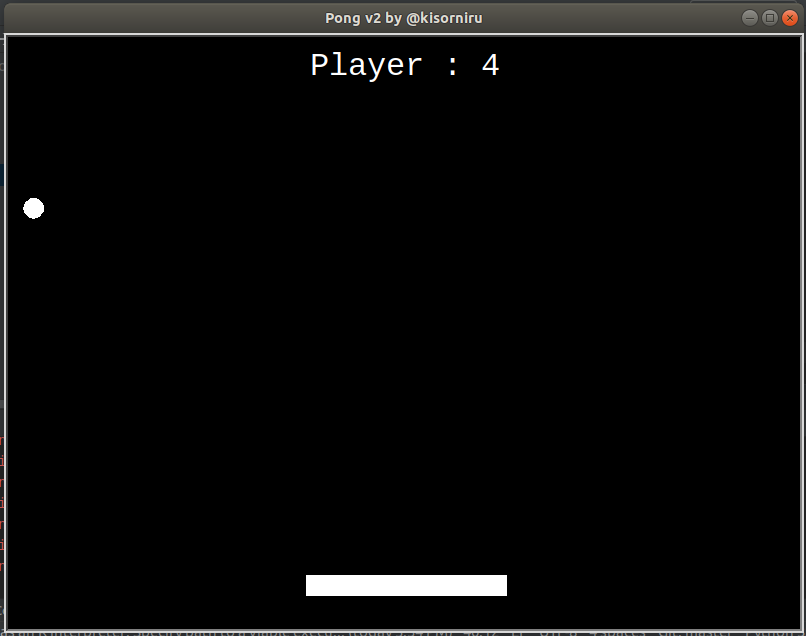
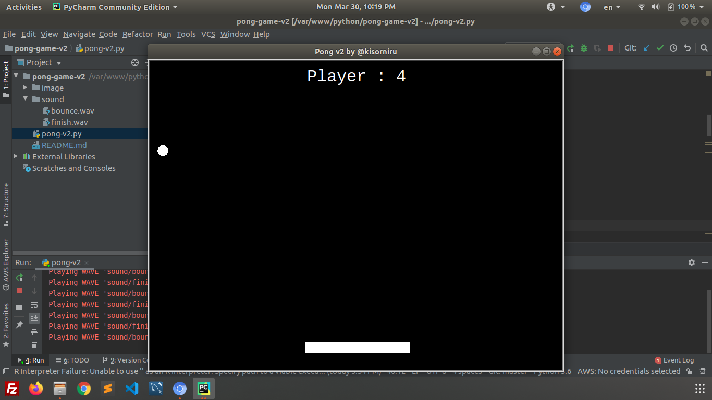

# pong-game

“Pong Game” is a classic game. I tried to develope it by python to learn python. I import “turtle” to work on terminal screen. Imported “os” to ensure sound. I personally use LINUX that's why use “os”, For windows use “winsound”, mac user can go with me. I added comments for better understand.




### Tech

developer uses a number of open source projects to work properly:

* [python]
* [turtle]
* [os]
* [winsound]

### Requirements

* python
* composer

### Installation

This project requires latest [composer](https://getcomposer.org/) version and [git](https://git-scm.com/) to run.

```sh
$ git clone git@github.com:kisorniru/pong-game.git
```

# After Installation

* check the code and update it by your owns



# Developed By
* [Siddique Noor-A-Alam]

